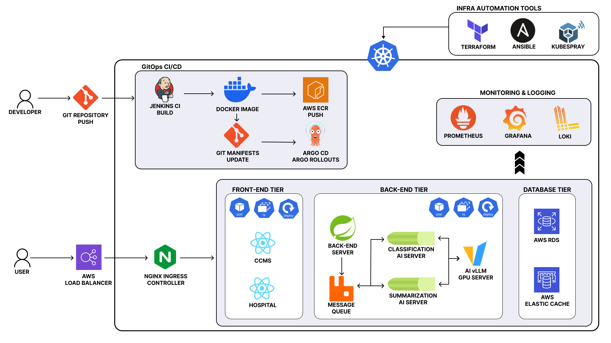

<h1>AI EMS</h1>
<h3>AI 기반 응급환자 이송 관제 시스템</h3>

<a href="https://www.youtube.com/live/uFstBCg65gI?si=U2qAlX3WVxnS3oH4"> <strong>SSAFY 13기 자율 프로젝트 전국 1위</strong> </a>

응급환자 이송 과정 내 병원 탐색 및 구급 활동 일지 작성 작업의 비효율성 개선 프로젝트

 

# 아키텍처

 

# 기술 스택

### Frontend

### Backend

### AI

### Infrastructure

### Monitoring

### DevOps & Tools

 

# 주요 기능

<table width="100%">
<tr align="center"><th width="25%">기능</th><th width="75%">설명</th></tr>
<tr><td><strong>핸즈프리 STT</strong></td><td>환자 이송 과정에서 별도 조작 없이 음성인식 STT 기반 환자 상태 보고, 병원 탐색 및 이송 요청 지원</td></tr>
<tr><td><strong>최적 병원 탐색</strong></td><td>환자 중증도 분석 AI 모델 및 중앙의료원 API 데이터 기반 골든타임 내 이송가능한 병원 탐색 지원</td></tr>
<tr><td><strong>이송 기록 자동화</strong></td><td>이송 음성 기록 분석 및 작성 AI 모델 기반 구급활동일지 자동 생성 지원</td></tr>
</table>

 

# 시스템 구성

<table width="100%">
<tr align="center"><th width="30%">구성</th><th width="70%">역할</th></tr>
<tr><td><strong>119 구급대 태블릿 애플리케이션</strong></td><td>기기 인증·운행 상태 관리, 환자 이송 요청 및 병원 탐색 기능</td></tr>
<tr><td><strong>응급실 웹사이트</strong></td><td>이송 요청 실시간 수신·응답, 환자 정보 조회, 구급차 위치·ETA 확인 기능</td></tr>
<tr><td><strong>중앙 관제 시스템</strong></td><td>전체 구급차량 운행 현황 모니터링, 실시간 데이터 중계 기능</td></tr>
<tr><td><strong>서비스 WAS 서버</strong></td><td>회원 인증·인가, 구급대·119·중앙관제 클라이언트 별 요청 처리 기능</td></tr>
</table>

 

# 레포지토리

<table width="100%">
<tr align="center"><th width="40%">Repository</th><th width="35%">설명</th><th width="25%">스택</th></tr>
<tr><td><code>final-pjt-aiems-mobile-ambulance</code></td><td>119 구급대 모바일 애플리케이션</td><td>Kotlin · Android</td></tr>
<tr><td><code>final-pjt-aiems-fe-er</code></td><td>병원 응급실 별 웹사이트</td><td>React · TypeScript</td></tr>
<tr><td><code>final-pjt-aiems-fe-ccms</code></td><td>119 중앙 관제 센터 웹사이트</td><td>React · TypeScript</td></tr>
<tr><td><code>final-pjt-aiems-be</code></td><td>WAS 서버</td><td>Spring Boot</td></tr>
<tr><td><code>final-pjt-aiems-ai-langgraph</code></td><td>구급활동일지 작성 AI 모델</td><td>Celery · LangGraph</td></tr>
<tr><td><code>final-pjt-aiems-ai-vllm</code></td><td>환자 분석 AI 모델</td><td>Celery · vllm</td></tr>
<tr><td><code>final-pjt-aiems-infra-iac</code></td><td>인프라 IaC 관리</td><td>Terraform · Ansible</td></tr>
<tr><td><code>final-pjt-aiems-infra-argocd-manifests</code></td><td>인프라 Deployment 관리</td><td>ArgoCD · ArgoRollouts</td></tr>
</table>

 

# 팀

<table width="100%">
<tr>
<th width="20%" align="center">Infra</th>
<th width="20%" align="center">Backend</th>
<th width="20%" align="center">Frontend</th>
<th width="20%" align="center">Mobile</th>
<th width="20%" align="center">AI</th>
</tr>
<tr align="center">
<td></td>
<td> </td>
<td> </td>
<td></td>
<td> </td>
</tr>
</table>

 

---

본 프로젝트의 모든 권리는 [SSAFY](https://www.ssafy.com/)에 있으며, 무단 복제·배포·사용·노출을 금합니다.

© 2025 [SSAFY](https://www.ssafy.com/). All rights reserved.

